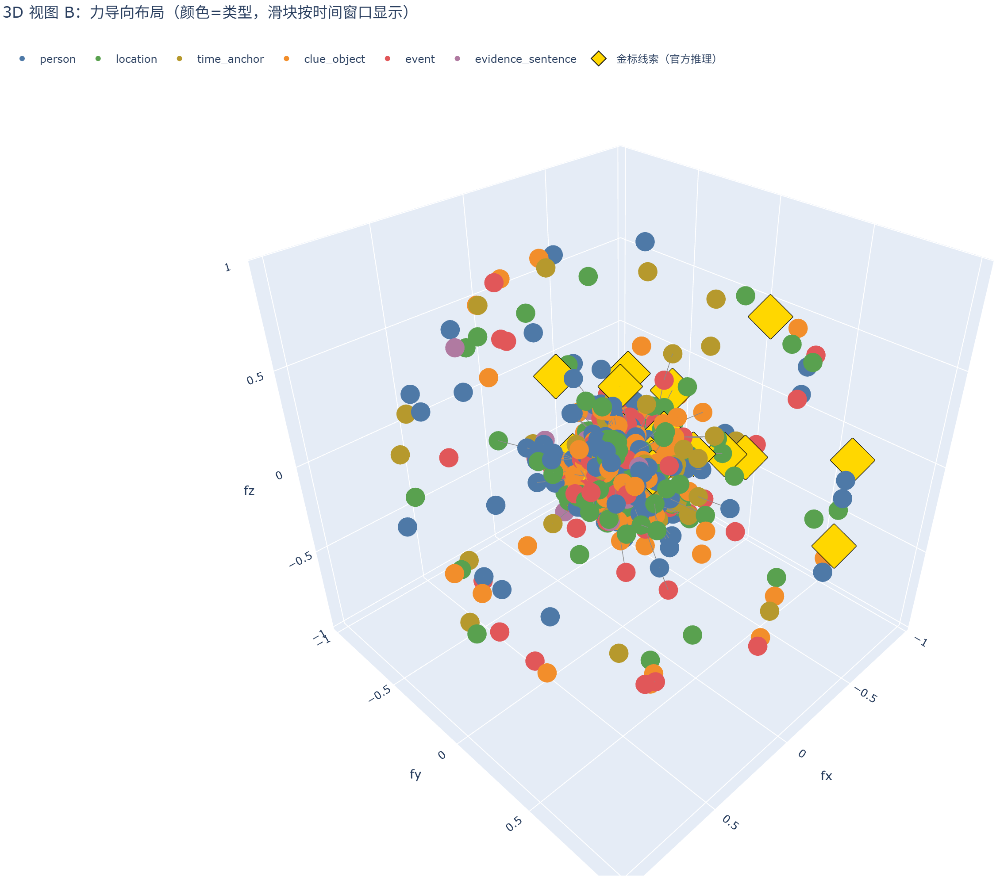

# Novel KG Studio

把整篇长篇小说拆成知识图谱（人物/线索/地点/时间/事件节点，关系用线相连），
提供图+词法混合 RAG 检索（题目 -> 一阶线索 -> 二阶扩散线索），
并生成三维动态可视化 dashboard（HTML，浏览器直接打开）。

## 图谱可视化

一部侦探小说的完整知识图谱（3D 力导向布局，节点颜色 = 实体类型，边 = 实体间关系）：



- **[交互版图谱（浏览器打开，可拖拽旋转 / 缩放）](docs/interactive_graph_3d.html)** —— 打开后鼠标拖拽旋转、滚轮缩放，悬停节点查看实体描述
- 完整研究 dashboard（全文删减、文本/时间尺密度、RAG 检索 3D 子图、LLM 过程可视化）位于 `outputs/` 由 `run_all` 生成

> 图注：图中节点为人物（蓝）、地点（绿）、线索物（橙）、事件（红）、时间锚（黄）、证据句（紫）。

## 论文与总报告

- **[数据、发现与论文全记录](docs/PROJECT_REPORT.md)** —— 所有数据、所有发现、中英文论文全文（推荐从这里开始）
- 英文 NeurIPS 2026 草稿：[`paper/neurips2026/main.tex`](paper/neurips2026/main.tex) / [PDF](paper/neurips2026/build/main.pdf)
- 中文完整版：[`paper/neurips2026_zh/main_zh.tex`](paper/neurips2026_zh/main_zh.tex) / [PDF](paper/neurips2026_zh/build/main_zh.pdf)
- 30 部小说冻结评测报告：[`outputs/four_datasets/dqa30_attention/REPORT_30_novels.md`](outputs/four_datasets/dqa30_attention/REPORT_30_novels.md)

## 流程

1. **第一遍 LLM**：遍历全文，剔除文学性内容，保留情节相关句子并按时间排序。
2. **第二遍 LLM**：对时间排序后的文本建知识图谱（实体 + 关系，证据逐字校验）。
3. **RAG**：BM25 索引节点文本 + 图谱一阶/二阶扩散检索。
4. **可视化**：删减条、两张尺子密度图、三个 3D 视图、RAG 检索 3D 子图。

## 安装

```bash
uv venv .venv
uv pip install -p .venv -e ".[dev]"
```

## 运行

```bash
$env:DEEPSEEK_API_KEY="sk-..."
$env:DEEPSEEK_BASE_URL="https://api.deepseek.com"
.venv\Scripts\python.exe -m novel_kg_studio.demo.run_all
```

输出到 `outputs/demo/dashboard.html`。

## 测试

```bash
.venv\Scripts\python.exe -m pytest -q
```

